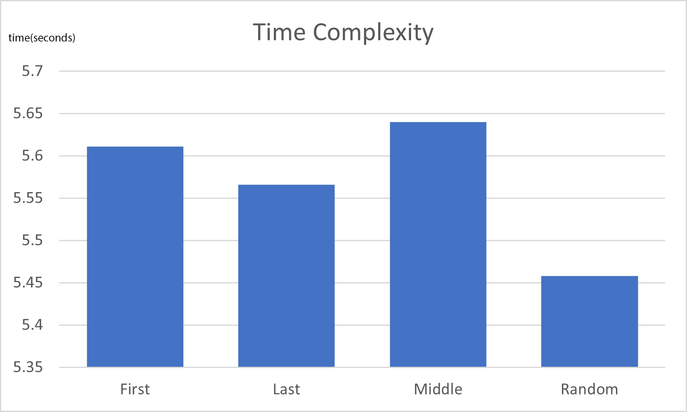
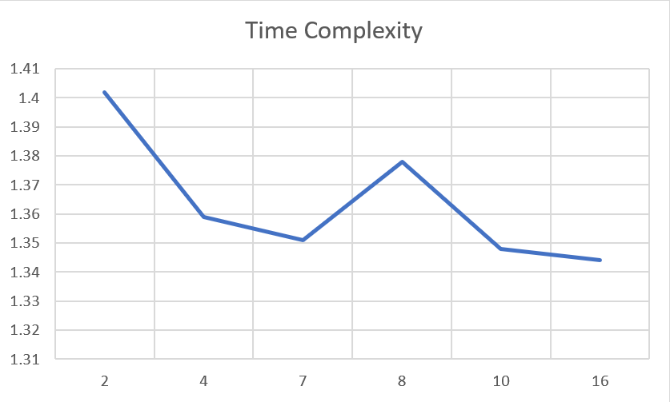
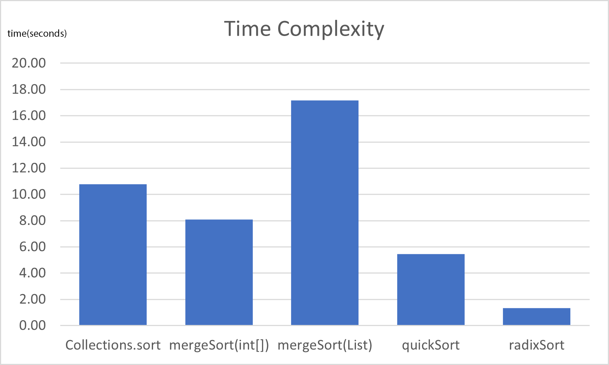
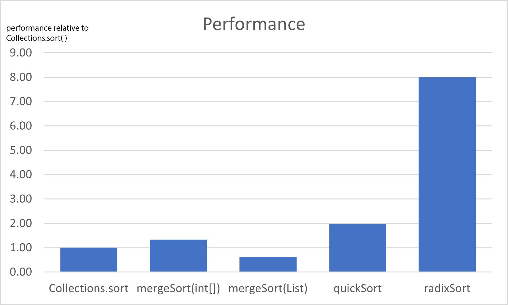

# Sorting Algorithms
In this assignment, we're asked to write an algorithm that sorts a list of integers.  
Java's built-in sorting method Collections.sort() will be our base-line and we'll try to beat its performance.  
To try to do this, I chose three well-known algorithms: Merge sort, Quicksort and Radix sort. Let's have a look at each one of these.
# Collections.sort()
If we take a deep look into the implementation of Collections.sort():
```Java
default void sort(Comparator<? super E> c) {
        Object[] a = this.toArray();
        Arrays.sort(a, (Comparator) c);
        ListIterator<E> i = this.listIterator();
        for (Object e : a) {
            i.next();
            i.set((E) e);
        }
    }
```
we can see that it works by copying the list into an array, uses Arrays.sort() then copies the sorted array back to the list. This adds a lot of overhead but it's actually better for performance because arrays are a lot faster to access and write to than lists. We'll demonstrate that later.  
According to the Java Documentation Arrays.sort() is a "stable, adaptive, iterative mergesort". Running the benchmark using Collections.sort() gives an average time of 10.79 seconds so our goal will be to beat that number.
# Merge Sort
Merge sort is stable, comparison-based sorting algorithm. It's also a divide and conquer algorithm. It has a time complexity of O(n log n) and memory complexity of O(n).  

To demonstrate the difference using arrays instead of lists makes, I implemented this algorithm for both arrays and lists and the results were 17.17 seconds for lists and 8.10 seconds for arrays. That's more than double the performance, which's a huge boost and that's why we'll be using arrays for all of the algorithms.  
Now let's look at how it works:
```Java
private void mergeSort(int[] arr, int low, int high) {
        // keeps recursively splitting until size of segment is <= 1
        if (low < high) {
            int pivot = (high + low) / 2;
            mergeSort(arr, low, pivot);
            mergeSort(arr, pivot + 1, high);
            merge(arr, low, pivot, high);
        }
    }
```
It keeps splitting the array into two halves and sorting each half on its own then it merges the results.
<div style="page-break-after: always;"></div>
Let's see how the merge happens:

```Java
private void merge(int[] arr, int low, int pivot, int high) {
        // values in the original array will be overwritten so we need a copy of it
        int[] lowerPart = new int[pivot - low + 1];
        int[] upperPart = new int[high - pivot];
        System.arraycopy(arr, low, lowerPart, 0, pivot + 1 - low);
        System.arraycopy(arr, pivot + 1, upperPart, 0, high - pivot);

        // merges both parts
        int i = low;
        for (int lowerItr = 0, upperItr = 0; i <= high;){
            if (lowerItr == lowerPart.length) {
                // in case we reach the end of the lower segment
                arr[i] = upperPart[upperItr];
                upperItr++;
            }
            else if (upperItr == upperPart.length) {
                // in case we reach the end of the upper segment
                arr[i] = lowerPart[lowerItr];
                lowerItr++;
            }
            else if (lowerPart[lowerItr] <= upperPart[upperItr]) {
                arr[i] = lowerPart[lowerItr];
                lowerItr++;
            }
            else {
                arr[i] = upperPart[upperItr];
                upperItr++;
            }
            i++;
        }
    }
```
At first it takes a copy of each segment because values in the original array will be overwritten.
Then merges them with a two pointers approach. Since both segments are sorted, it just has to put them in the right order while merging.  
This algorithm gets a score of 8.10 in the benchmark, while this is already a lot better than Collections.sort(), the other algorithms could prove to be better for our application. So let's look at the other two. Also, it's noteworthy that this implementation gets a better score than Collections.sort() (it's expected to be otherwise because it's a lot more optimized than my implementation) because the latter performs on arrays of objects, which adds a lot of overhead.

# Quicksort
Quicksort is a comparison-based sorting algorithm and same as merge sort, it's a divide and conquer algorithm. Unlike merge sort though, most implementations of Quicksort aren't stable, which means equal values could be reordered.
Quicksort has a complexity of O(n log n) and memory complexity of O(log n) which gives it an advantage over merge sort.
Now looking at the implementation:
```Java
private void quickSort(int[] arr, int low, int high) {
        // keeps recursively splitting until size of segment is <= 1
        if (low < high) {
            // splits the segment into two parts then sorts each segment on its own
            int pivot = split(arr, low, high);
            quickSort(arr, low, pivot - 1);
            quickSort(arr, pivot + 1, high);
        }
    }
```
We can see it first splits the array into two parts and then sorts each part on its own and keeps doing that recursively. Looking at the `split()` method:
``` Java
private int split(int[] arr, int low, int high) {
    int pivot = choosePivot(low, high); // gets the pivot
    swap(arr, pivot, high); // puts the pivot at the end of the segment
    // puts values smaller than the pivot at the beginning of the segment
    int i = low - 1;
    for (int j = low; j < high; j++) {
        if (arr[j] <  arr[high]) {
            i++;
            swap(arr, i, j);
        }
    }
    // puts the pivot in the middle of the segment
    swap(arr, i + 1, high);
    return i + 1;
}
```
It first chooses a pivot element, puts it at the end of the array then iterates over the array putting values smaller than the pivot at the beginning of the array and at the end it puts the pivot element at the middle of the array such that all values to its left are smaller than it and all values to its right are bigger than it.
There are many methods to choose the pivot and these method could affect the performance of the algorithm greatly. I tried four methods for choosing the pivot: choosing the first element, choosing the last element, choosing the middle element and lastly picking a random element, and I got the following results:


This shows that random is the best option here with 5.46 seconds. This is a great improvement over merge sort and an even better improvement over Collections.sort() with almost double the performance.

<div style="page-break-after: always;"></div>

# Radix Sort
Radix sort is a stable, non-comparative sorting algorithm. It's a less general algorithm than the other two as it only works on elements that can be sorted lexicographically.
Radix sort has a complexity of O(n * m) where m is the number of digits in the maximum number in the array and a memory complexity of O(n).
Let's look at how it works:
```Java
private void radixSort(int[] arr, int radix) {
    // finds the max value and then gets the count of digits it has
    int max = max(arr);
    int digitCount = (int) Math.floor((Math.log10(max) / Math.log10(radix) + 1));
    int[] original = arr.clone(); // values in arr will be overwritten so we need a copy of it
    for (int digit = 0; digit < digitCount; digit++) {
        // uses count sort to sort the array according to each digit
        countingSort(arr, original, radix, digit);
    }
}
```
It first finds the maximum element in the array then gets the number of digits it has.
After that, it gets a copy of the array because the values in it will be over written, this can be done only once at the beginning because it's stable and it keeps the order of equal elements. Then, it sorts the array according to each digit from least significant to most significant using counting sort.
```Java
private void countingSort(int[] arr, int[] original, int radix, int digit) {
        int[] digitFreq = new int[radix];
        int div = (int) Math.pow(radix, digit);

        // finds the area each value will cover in the result array
        for (int element: arr) {
            int number = (element / div) % radix;
            digitFreq[number]++;
        }
        for (int i = 1; i < radix; i++)
            digitFreq[i] += digitFreq[i - 1];

        // does the actual sorting
        for (int i = arr.length - 1; i >= 0; i--) {
            int number = (original[i] / div) % radix;
            digitFreq[number]--;
            arr[digitFreq[number]] = number;
        }
    }
```
Counting sort works by first getting the weight of the digit we want to sort the array according to. Then it gets the frequency of each value for that digit and does cumulative sum on the frequency array, this way for each possible value of this digit, it gets the index until which its occurrences will cover in the resulting array.  
Then it starts filling the elements in the result array by getting its value and finding where it has to be using the cumulative sum array. It decrements the cumulative sum array for that value so that the next time this value comes up, it'll be put behind the current element.
<div style="page-break-after: always;"></div>
Radix sort could be done with any base, so I tried a few and got these results:  
 <br />
We can see that base16 gave the best results with 1.35 seconds. That's a huge improvement over the other options. It gives 8 times better performance than Collections.sort().

<div style="page-break-after: always;"></div>

# Analysis
looking at the results for each option:  



  

We can clearly see that radix sort is the best algorithm for our application with 8 times better performance than our base-line and 4 times better performance than the closest competitor.  
Radix sort is a bit heavy on memory, so quicksort might be a good trade-off between performance and memory here.

# Conclusion
At the end of the day, there isn't an absolute best sorting algorithm. Each algorithm has it's advantages and disadvantages and for each, there's a place where it'll perform better than the rest. For our application, Radix Sort proved to be the best.
